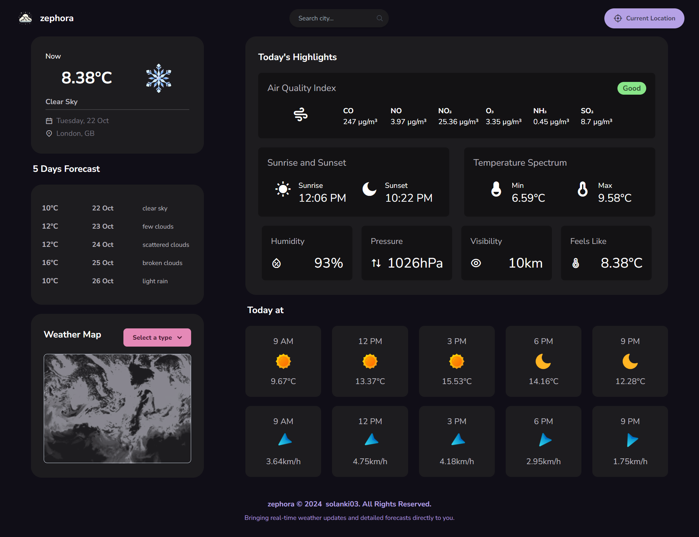

# zephora

**zephora** is a sleek and easy-to-use React-based weather app that provides detailed forecasts and real-time updates. It leverages the power of the [OpenWeatherMap API](https://openweathermap.org/) to fetch accurate weather data. The UI is designed using the **Bento grid** layout, ensuring a modern, user-friendly experience.

## Screenshot


## Features

- Real-time weather updates and 5-day forecast
- Air Quality Index (AQI) for key pollutants
- Sunrise and sunset times based on location
- Max/min temperatures, humidity, pressure, visibility, and "feels like" temperature
- Interactive weather maps with layers for Clouds, Precipitation, Wind Speed, and more
- Hourly temperature and wind speed in 3-hour intervals
- City search and current location weather data


## Technologies Used

- **React**
- **Tailwind CSS**
- **Vite**


## How to Run the Project

1. **Clone the Repository**:

   ```bash
   git clone https://github.com/your-username/zephora.git
    ```
2. **Navigate to the project directory**:

   ```bash
   cd zephora
    ```
3. **Install Dependencies**:

   ```bash
   npm install
    ```
4. **Start the Development Server**:

   ```bash
   npm run dev
    ```


## API Integration

This app uses the **OpenWeatherMap** API to fetch the weather data. Visit below mentioned website and register yourself to get your api key.

```http
  https://openweathermap.org/
```


## Environment Variables

To run this project, you will need to add the following environment variables to your .env file

`VITE_API_KEY = your_api_key`


## License

This project is licensed under the **[MIT License](https://choosealicense.com/licenses/mit/)**. See the LICENSE file for more details.

